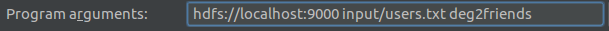

# FollowAnalyzer
基于MapReduce的二度人脉

# 执行参数

# 详细说明
社交网站上的各个用户以及用户之间的相互关注可以抽象为一个图。以下图为例： 

 
现在我们以上图为例，介绍下如何利用用户之间相互关注所构成的图，来向每个用户推荐好友。首先我们不得不假设的是如果两用户之间相互关注，那么我们认为他们认识或者说是现实中的好友，至少应该认识。假设我们现在需要向用户I推荐好友，我们发现用户I的好友有H、G、C。其中H的好友还有A，C的好友还有B、F。那么用户I、H、G、C、A、B、F极有可能是同一个圈子里的人。我们应该把用户A、B、F推荐给用户I认识。 
我们的输入是users.txt，保存用户之间相互关注的信息。每行有两个用户ID，以\t分割，表示这两个用户之间相互关注即认识。 
users.txt 
二度好友的计算需要两轮的MapReduce。第一轮MapReduce的Map中，如果输入是“H	I”，我们的输出是key=H，value=“H	I”跟key=I，value=“H	I”两条结果。前者表示I可以通过H去发现他的二度好友，后者表示H可以通过I去发现他的二度好友。 
根据第一轮MapReduce的Map，第一轮MapReduce的Reduce 的输入是例如key =I，value={“H	I”、“C	I”、“G	I”} 。其实Reduce的输入是所有与Key代表的结点相互关注的人。如果H、C、G是与I相互关注的好友，那么H、C、G就可能是二度好友的关系，如果他们之间不是相互关注的。对应最上面的图，H与C是二度好友，G与C是二度好友，G与H也是二度好友。第一轮MapReduce的Reduce的处理就是把相互关注的好友对标记为一度好友（“deg1friend”）并输出，把有可能是二度好友的好友对标记为二度好友（“deg2friend”）并输出。 
第二轮MapReduce则需要根据第一轮MapReduce的输出，即每个好友对之间是否是一度好友（“deg1friend”），是否有可能是二度好友（“deg2friend”）的关系，确认他们之间是不是真正的二度好友关系。如果他们有deg1friend的标签，那么不可能是二度好友的关系；如果有deg2friend的标签、没有deg1friend的标签，那么他们就是二度好友的关系。另外，特别可以利用的是，某好友对deg2friend标签的个数就是他们成为二度好友的支持数，即他们之间可以通过多少个都相互关注的好友认识。 
结果输出 
